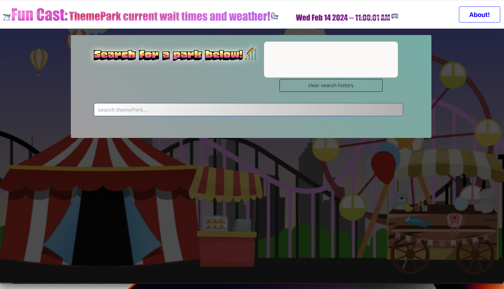
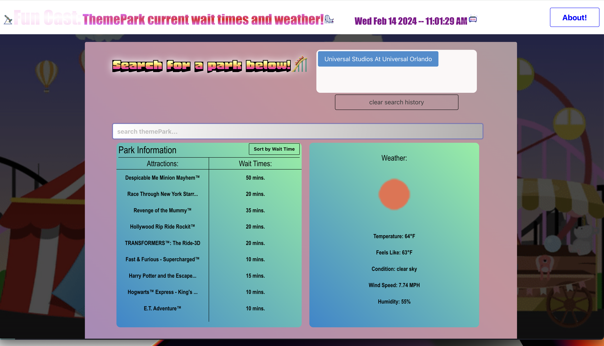

# Funcast: Current Theme Park Wait Times and Weather

Funcast is a web application designed to enhance the theme park experience by providing current wait times for attractions and weather updates. This tool is perfect for on-the-go theme park enthusiasts who want to maximize their day by making quick decisions about which park to visit or which attraction to enjoy using consistently-updated wait times and weather information.

# Credit: Team Strings

## Team Members
-**David Wright**

-**Mark Barrie**

-**Bradley Troll**

-**Brian Nunez**

-**Eric Lackram**

## User Story

```

AS A Theme Park patron
I WANT to see the wait times for rides and the weather
SO THAT I can plan my day accordingly
```

## Acceptance Criteria

```

GIVEN a webpage that has 1 or more inputs
WHEN I begin to search for a park
THEN I am presented with potential search reults via autocomplete
WHEN I select a park
THEN I am presented with the weather for that location
WHEN I select a park 
THEN I am presented with the list of rides by lowest wait times to highest
THEN I am presented with a button to sort rides by alphabetical order for wait times from lowest to highest


```

## Description
The purpose of this web application is to help people search theme park rides and their wait times, along with weather affiliated with that area.

## Technologies

Funcast leverages the following technologies:

- HTML5
- CSS3 with Bulma Framework
    - [Bulma](https://bulma.io/)
- JavaScript
- jQuery
- AJAX for API requests
- APIs Used:
  - Theme Park Wait Times API (https://queue-times.com/en-US/pages/api)
  - Open Weather API (https://openweathermap.org/api)


## Screenshots

- 

- 

- 

- 

- 


## Features

- **Theme Park Search:** Users can search for theme parks to find current wait times for various attractions.
- **Weather Updates:** Alongside wait times, users can view the current weather at the selected theme park to plan their visit accordingly.
- **Autocomplete Search:** As users type in the search box, the application suggests theme parks matching the input for an easier and faster search experience.
- **Sort Functionality:** Attractions can be sorted by wait times or alphabetically, allowing users to easily find rides.
- **Recent Searches:** The application keeps track of users' recent searches for quick access to previously viewed parks.
- **Responsive Design:** Funcast is designed to work on both desktop and mobile devices, ensuring a seamless experience regardless of where it's accessed.

## Setup

To run this project locally, clone the GitHub repository to your computer. Open the `index.html` file in a web browser to launch the application. No additional installation is required, as all dependencies are accessed through CDN.

## Usage

1. **Starting the Application:** Open `index.html` in your web browser.
2. **Searching for a Theme Park:** Begin typing the name of the theme park in the search box. Select your desired park from the autocomplete suggestions.
3. **Viewing Wait Times and Weather:** Once a park is selected, the application displays current wait times for attractions and the current weather.
4. **Sorting Attractions:** Use the "Sort by Wait Time" button to organize attractions based on wait time or alphabetically.

## Contribution

Contributions to Funcast are welcome! If you have suggestions or improvements, please fork the repository and create a pull request or open an issue with your ideas.

## Deployed Application Link

INSERT HERE
